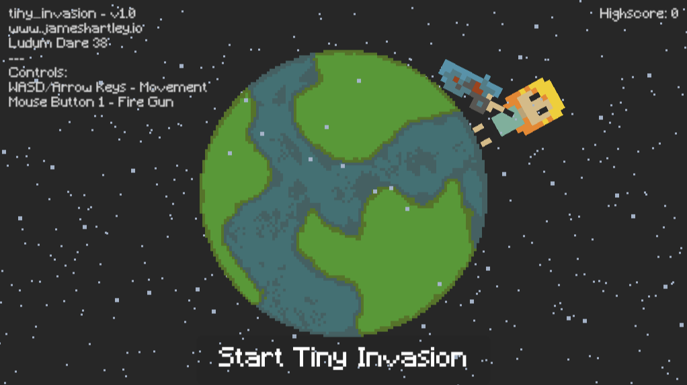
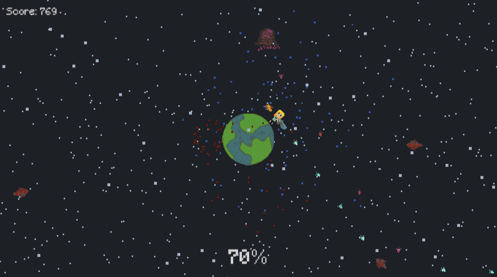

# Tiny Invasion

Welcome to **Tiny Invasion**, a game created for Ludum Dare 38. In this action-packed adventure, you must run around a tiny planet, using your trusty gun to fend off invaders while taking cover behind the planet itself. For some reason, this little world just won't blow up! But watch out for the crazy purple space ghost with laser eyes - it's out to get you!

## Gameplay Features

- Fast-paced, arcade-style action.
- Defend the tiny planet from relentless invaders.
- Use the planet as a shield to protect yourself.
- Beware of the menacing purple space ghost with laser eyes.
- Can you survive the invasion and set a high score?

## How to Play

You can play **Tiny Invasion** on Newgrounds by following this link: [Play Tiny Invasion on Newgrounds](https://www.newgrounds.com/portal/view/692555)

## Development Details

This was developed on Unity. Unfortunately, the source code for **Tiny Invasion** has been lost. However, you can still enjoy the game on Newgrounds and challenge yourself to achieve the highest score possible.

This was a solo project for a 48 hour game jam, all scripts, artwork and sounds were done by myself. A fun fact was this was all developed on Linux using the beta unity editor. (very buggy!)
